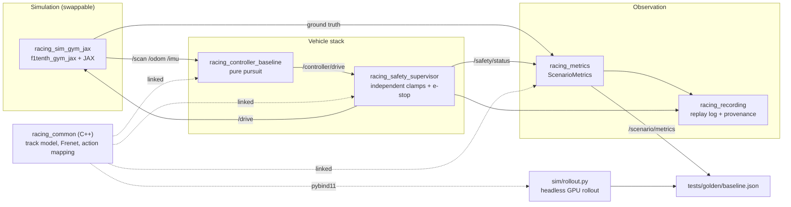

# GR-roboracer

An autonomous racing software stack for the F1TENTH / RoboRacer platform, on ROS 2 Jazzy.

The goal is a vehicle that laps a track quickly and provably safely, and a development loop where
that claim is checked automatically: a seeded run through the real launch produces a metrics record,
and that record is compared field by field against a committed golden baseline. If the car gets
slower, drifts wider, or brushes a wall closer than it used to, a test says so.

## Architecture



Two things carry most of the design:

- **The safety supervisor is independent of the controller.** It re-derives the vehicle's position
  against the track model itself and clamps or stops the command on its way to `/drive`. A controller
  bug cannot talk its way past it.
- **Every node is a thin ROS shell over a ROS-free core**, so the real logic is covered by tests that
  run in milliseconds without a graph. The same C++ track model is linked by the ROS nodes and
  imported, through pybind11, by the headless simulator — one implementation, two products
  ([ADR 0003](docs/adr/0003-sim-outside-ros-workspace.md)).

## Quickstart

```bash
git clone git@github.com:G-S-Rodrigues/GR-roboracer.git ~/gitroot/GR-roboracer
cd ~/gitroot/GR-roboracer
docker compose -f docker/docker-compose.yaml up -d dev
docker exec -it gr-roboracer-dev bash -lc \
  'cd /ws && colcon build --base-paths ros_ws/src --symlink-install && ./scripts/check.sh --full'
```

Then watch it lap:

```bash
ros2 launch racing_bringup sim_pure_pursuit.launch.py seed:=42
```

Full host setup, scenario usage and troubleshooting: [docs/running.md](docs/running.md).

## Documentation

| | |
|---|---|
| [docs/adr/](docs/adr/README.md) | Decisions that were hard to reverse, and why |
| [docs/agents/testing.md](docs/agents/testing.md) | The test tiers and what each one is for |
| [docs/agents/repo-gotchas.md](docs/agents/repo-gotchas.md) | Traps that fail silently rather than loudly |
| [docs/research/](docs/research/README.md) | Survey of open-source autonomous racing stacks |

## Status

Under active development. The vertical slice is complete: a seeded run drives the composed graph
through a full lap and its metrics are asserted against a golden baseline at tiers 3 and 4. Mapping,
localisation, an optimised raceline and hardware bring-up are next.

## Licence

MIT — see [LICENSE](LICENSE).
