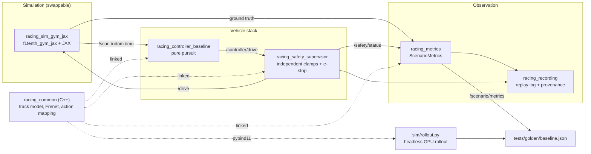

# GR-roboracer

An autonomous racing software stack for the F1TENTH / RoboRacer platform, on ROS 2 Jazzy.

The goal is a vehicle that laps a track quickly and provably safely, and a development loop where
that claim is checked automatically: a seeded run through the real launch produces a metrics record,
and that record is compared field by field against a committed golden baseline. If the car gets
slower, drifts wider, or brushes a wall closer than it used to, a test says so.

## Architecture


```mermaid
flowchart LR
    subgraph sim["Simulation (swappable)"]
        GYM["racing_sim_gym_jax<br/>f1tenth_gym_jax + JAX"]
    end
    subgraph stack["Vehicle stack"]
        CTRL["racing_controller_baseline<br/>pure pursuit"]
        SAFE["racing_safety_supervisor<br/>independent clamps + e-stop"]
    end
    subgraph obs["Observation"]
        MET["racing_metrics<br/>ScenarioMetrics"]
        REC["racing_recording<br/>replay log + provenance"]
    end

    GYM -- "/scan /odom /imu" --> CTRL
    GYM -- ground truth --> MET
    CTRL -- "/controller/drive" --> SAFE
    SAFE -- "/drive" --> GYM
    SAFE -- "/safety/status" --> MET
    MET -- "/scenario/metrics" --> GOLD["tests/golden/baseline.json"]
    MET --> REC
    SAFE --> REC

    COMMON["racing_common (C++)<br/>track model, Frenet, action mapping"]
    COMMON -.->|"linked"| CTRL
    COMMON -.->|"linked"| SAFE
    COMMON -.->|"linked"| MET
    COMMON -.->|"pybind11"| ROLL["sim/rollout.py<br/>headless GPU rollout"]
    ROLL --> GOLD
```

Two things carry most of the design:

- **The safety supervisor is independent of the controller.** It re-derives the vehicle's position
  against the track model itself and clamps or stops the command on its way to `/drive`. A controller
  bug cannot talk its way past it.
- **Every node is a thin ROS shell over a ROS-free core**, so the real logic is covered by tests that
  run in milliseconds without a graph. The same C++ track model is linked by the ROS nodes and
  imported, through pybind11, by the headless simulator — one implementation, two products
  ([ADR 0003](docs/adr/0003-sim-outside-ros-workspace.md)).

## Quickstart

```bash
git clone git@github.com:G-S-Rodrigues/GR-roboracer.git ~/gitroot/GR-roboracer
cd ~/gitroot/GR-roboracer
docker compose -f docker/docker-compose.yaml up -d dev
docker exec -it gr-roboracer-dev bash -lc \
  'cd /ws && colcon build --base-paths ros_ws/src --symlink-install && ./scripts/check.sh --full'
```

Full host setup, scenario usage and troubleshooting: [docs/running.md](docs/running.md).

## Running each implementation

Every implementation in the stack has an entry here: the command that launches it and, in time, a
video of it running. Implementations are added, never replaced
([ADR 0005](docs/adr/0005-algorithms-are-added-not-replaced.md)), so this list only grows. A new
implementation adds its own entry.

Every command runs inside the `dev` container, from `/ws`, after a build:

```bash
docker compose -f docker/docker-compose.yaml up -d dev
docker exec -it gr-roboracer-dev bash
source setup.sh && colcon build --base-paths ros_ws/src --symlink-install
```

RViz opens with every launch (`use_rviz:=false` to skip it). `seed` picks the start pose,
`time_scale:=2.0` runs faster than real time, and `scenario` picks the track: omitted, it is
`analytic_circle`, a cheap circle that must never be used to judge localization
([repo-gotchas #18](docs/agents/repo-gotchas.md)). The localization entries use Spielberg.

### Pure pursuit on ground-truth pose — the reference stack

The default composition: the controller drives on the simulator's exact pose, the safety
supervisor clamps its commands.

```bash
ros2 launch racing_bringup sim_pure_pursuit.launch.py scenario:=config/scenarios/spielberg.yaml seed:=42
```

> Video: _to be added_

### slam_toolbox — map the track

A survey lap: the car drives on ground truth while slam_toolbox's mapper lays the scans down, and
the resulting occupancy grid is what AMCL later localizes against. RViz shows the map growing on
`/map`.

```bash
ros2 launch racing_bringup slam_toolbox_mapping.launch.py scenario:=config/scenarios/spielberg_survey.yaml seed:=42
```

Once the lap completes, save the map from a second shell in the container:

```bash
ros2 run nav2_map_server map_saver_cli -f log/Spielberg --fmt png --occ 0.65 --free 0.196 --ros-args -p use_sim_time:=true -p map_subscribe_transient_local:=true
```

`./scripts/map_track.sh config/scenarios/spielberg_survey.yaml config/scenarios/maps/Spielberg/slam/Spielberg`
does both headless and overwrites the committed grid AMCL uses; that is a reviewed diff.

> Video: _to be added_

### slam_toolbox — online SLAM as the pose source

slam_toolbox maps and localizes at once, owns `map -> odom`, and is scored live against ground
truth by `racing_evaluation`. `drive_on_estimate:=false` keeps the car on ground truth while the
estimate is measured: driving on the slam_toolbox estimate latches a `TRACK_LIMIT` stop.

```bash
ros2 launch racing_bringup sim_pure_pursuit.launch.py scenario:=config/scenarios/spielberg.yaml pose_source:=slam_toolbox drive_on_estimate:=false seed:=42
```

> Video: _to be added_

### nav2_amcl — localize on the saved map

AMCL localizes against the committed occupancy grid
(`config/scenarios/maps/Spielberg/slam/`), served by `nav2_map_server`, and owns `map -> odom`.
The car drives on its estimate (closed loop). Add a **ParticleCloud** display on `/particle_cloud`
in RViz to watch the particles.

```bash
ros2 launch racing_bringup sim_pure_pursuit.launch.py scenario:=config/scenarios/spielberg.yaml pose_source:=amcl seed:=42
```

Add `drive_on_estimate:=false` to score it while the car drives on ground truth.

> Video: _to be added_

### Headless, without RViz

Any of the above as a seeded run that prints its metrics record, which is what the tests drive:

```bash
./scripts/run_scenario.py --seed 42 --scenario config/scenarios/spielberg.yaml --pose-source amcl
```

## Documentation

| | |
|---|---|
| [docs/adr/](docs/adr/README.md) | Decisions that were hard to reverse, and why |
| [docs/agents/testing.md](docs/agents/testing.md) | The test tiers and what each one is for |
| [docs/agents/repo-gotchas.md](docs/agents/repo-gotchas.md) | Traps that fail silently rather than loudly |
| [docs/research/](docs/research/README.md) | Survey of open-source autonomous racing stacks |

## Status

Under active development. The vertical slice runs on simulated time on two tracks (the analytic
circle and Spielberg) with noisy sensors, and a seeded lap's metrics are asserted against a golden
baseline. Three pose sources are selectable (ground truth, slam_toolbox, nav2_amcl) and scored by
the same evaluation harness. An optimised raceline, a second controller and hardware bring-up are
next.

## Licence

MIT — see [LICENSE](LICENSE).
